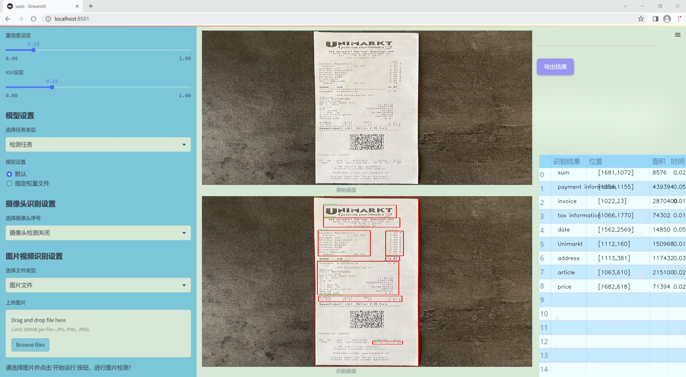

# 改进yolo11-ASF-DySample等200+全套创新点大全：发票信息提取系统源码＆数据集全套

### 1.图片效果展示




##### 项目来源 **[人工智能促进会 2024.11.01](https://kdocs.cn/l/cszuIiCKVNis)**

注意：由于项目一直在更新迭代，上面“1.图片效果展示”和“2.视频效果展示”展示的系统图片或者视频可能为老版本，新版本在老版本的基础上升级如下：（实际效果以升级的新版本为准）

  （1）适配了YOLOV11的“目标检测”模型和“实例分割”模型，通过加载相应的权重（.pt）文件即可自适应加载模型。

  （2）支持“图片识别”、“视频识别”、“摄像头实时识别”三种识别模式。

  （3）支持“图片识别”、“视频识别”、“摄像头实时识别”三种识别结果保存导出，解决手动导出（容易卡顿出现爆内存）存在的问题，识别完自动保存结果并导出到tempDir中。

  （4）支持Web前端系统中的标题、背景图等自定义修改。

  另外本项目提供训练的数据集和训练教程,暂不提供权重文件（best.pt）,需要您按照教程进行训练后实现图片演示和Web前端界面演示的效果。

### 2.视频效果展示

[2.1 视频效果展示](https://www.bilibili.com/video/BV1tHS9YwEdK/)

### 3.背景

研究背景与意义

随着电子商务的迅猛发展，发票作为商业交易的重要凭证，其信息的自动提取与处理变得愈发重要。传统的发票信息提取方法多依赖人工输入，效率低下且易出错，无法满足现代企业对数据处理速度和准确性的高要求。因此，开发一种高效、准确的发票信息提取系统显得尤为必要。近年来，深度学习技术的飞速发展为图像识别和信息提取提供了新的解决方案，其中YOLO（You Only Look Once）系列模型因其实时性和高精度而备受关注。

本研究旨在基于改进的YOLOv11模型，构建一个高效的发票信息提取系统。我们所使用的数据集包含756张发票图像，涵盖了多个重要信息类别，如地址、商品、日期、价格、税务信息等。这些类别不仅是发票信息提取的核心内容，也是后续财务分析和数据挖掘的基础。通过对这些类别的准确识别与提取，企业能够实现自动化的财务管理，提升工作效率，降低人工成本。

在技术实现上，YOLOv11模型通过其创新的网络结构和训练方法，能够在保证高精度的同时，提升信息提取的速度。针对发票图像的特性，我们将对模型进行针对性的改进，以适应不同发票格式和排版的多样性。此外，结合数据增强技术和迁移学习策略，我们期望进一步提升模型的泛化能力，使其在实际应用中能够有效应对各种复杂场景。

综上所述，本研究不仅具有重要的理论意义，推动了深度学习在信息提取领域的应用，也具备广泛的实际应用价值，能够为企业的财务管理提供有力支持，助力数字化转型的进程。

### 4.数据集信息展示

##### 4.1 本项目数据集详细数据（类别数＆类别名）

nc: 12
names: ['Billa', 'Hofer', 'Spar', 'Unimarkt', 'address', 'article', 'date', 'invoice', 'payment information', 'price', 'sum', 'tax information']


该项目为【目标检测】数据集，请在【训练教程和Web端加载模型教程（第三步）】这一步的时候按照【目标检测】部分的教程来训练

##### 4.2 本项目数据集信息介绍

本项目数据集信息介绍

本项目所使用的数据集名为“Invoice Detection”，旨在为改进YOLOv11的发票信息提取系统提供支持。该数据集包含12个类别，涵盖了发票中常见的关键信息，具体类别包括：Billa、Hofer、Spar、Unimarkt、地址、商品、日期、发票、支付信息、价格、总计以及税务信息。这些类别的设计充分考虑了发票的实际应用场景，确保系统能够准确提取并识别各种重要信息。

在数据集的构建过程中，我们采集了多种类型的发票样本，确保数据的多样性和代表性。这些样本来自不同的商家和服务提供商，涵盖了多种格式和布局，以模拟真实世界中可能遇到的各种情况。通过这种方式，我们的目标是提高YOLOv11在处理不同发票时的鲁棒性和准确性，进而提升信息提取的效率。

数据集中的每个类别都经过精心标注，以确保训练过程中模型能够学习到每种信息的特征。例如，商品类别不仅包括商品名称，还涵盖了数量和单价等信息，而支付信息则涉及到支付方式和交易编号等细节。这种细致的标注使得模型在训练时能够更好地理解和区分不同类别之间的关系，从而提高提取的准确性。

此外，为了确保模型的泛化能力，我们还进行了数据增强处理，包括旋转、缩放和颜色调整等。这些技术手段不仅丰富了训练数据的多样性，还有效降低了模型对特定样本的过拟合风险。通过这样的数据集构建和处理策略，我们期望能够显著提升YOLOv11在发票信息提取任务中的表现，为实际应用提供更加高效和可靠的解决方案。


### 5.全套项目环境部署视频教程（零基础手把手教学）

[5.1 所需软件PyCharm和Anaconda安装教程（第一步）](https://www.bilibili.com/video/BV1BoC1YCEKi/?spm_id_from=333.999.0.0&vd_source=bc9aec86d164b67a7004b996143742dc)


[5.2 安装Python虚拟环境创建和依赖库安装视频教程（第二步）](https://www.bilibili.com/video/BV1ZoC1YCEBw?spm_id_from=333.788.videopod.sections&vd_source=bc9aec86d164b67a7004b996143742dc)

### 6.改进YOLOv11训练教程和Web_UI前端加载模型教程（零基础手把手教学）

[6.1 改进YOLOv11训练教程和Web_UI前端加载模型教程（第三步）](https://www.bilibili.com/video/BV1BoC1YCEhR?spm_id_from=333.788.videopod.sections&vd_source=bc9aec86d164b67a7004b996143742dc)


按照上面的训练视频教程链接加载项目提供的数据集，运行train.py即可开始训练



     Epoch   gpu_mem       box       obj       cls    labels  img_size
     1/200     20.8G   0.01576   0.01955  0.007536        22      1280: 100%|██████████| 849/849 [14:42<00:00,  1.04s/it]
               Class     Images     Labels          P          R     mAP@.5 mAP@.5:.95: 100%|██████████| 213/213 [01:14<00:00,  2.87it/s]
                 all       3395      17314      0.994      0.957      0.0957      0.0843

     Epoch   gpu_mem       box       obj       cls    labels  img_size
     2/200     20.8G   0.01578   0.01923  0.007006        22      1280: 100%|██████████| 849/849 [14:44<00:00,  1.04s/it]
               Class     Images     Labels          P          R     mAP@.5 mAP@.5:.95: 100%|██████████| 213/213 [01:12<00:00,  2.95it/s]
                 all       3395      17314      0.996      0.956      0.0957      0.0845

     Epoch   gpu_mem       box       obj       cls    labels  img_size
     3/200     20.8G   0.01561    0.0191  0.006895        27      1280: 100%|██████████| 849/849 [10:56<00:00,  1.29it/s]
               Class     Images     Labels          P          R     mAP@.5 mAP@.5:.95: 100%|███████   | 187/213 [00:52<00:00,  4.04it/s]
                 all       3395      17314      0.996      0.957      0.0957      0.0845


###### [项目数据集下载链接](https://kdocs.cn/l/cszuIiCKVNis)

### 7.原始YOLOv11算法讲解

YOLOv11是一种由Ultralytics公司开发的最新一代目标检测模型，以其增强的特征提取能力和更高的效率在计算机视觉领域引人注目。该模型在架构上进行了关键升级，通过更新主干和颈部结构，显著提高了对复杂视觉场景的理解和处理精度。YOLOv11不仅在目标检测上表现出色，还支持实例分割、图像分类、姿态估计和定向目标检测（OBB）等任务，展示出其多功能性。

与其前身YOLOv8相比，YOLOv11在设计上实现了深度和宽度的改变，同时引入了几个创新机制。其中，C3k2机制是对YOLOv8中的C2f的改进，提升了浅层特征的处理能力；C2PSA机制则进一步优化了特征图的处理流程。解耦头的创新设计，通过增加两个深度卷积（DWConv），提高了模型对细节的感知能力和分类准确性。

在性能上，YOLOv11m模型在COCO数据集上的平均精度（mAP）提高，并减少了22%的参数量，确保了在运算效率上的突破。该模型可以部署在多种平台上，包括边缘设备、云平台以及支持NVIDIA GPU的系统，彰显出卓越的灵活性和适应性。总体而言，YOLOv11通过一系列的创新突破，对目标检测领域产生了深远的影响，并为未来的开发提供了新的研究方向。


****文档**** ： _ _https://docs.ultralytics.com/models/yolo11/__

****代码链接**** ： _ _https://github.com/ultralytics/ultralytics__

******Performance Metrics******


​ ** **关键特性****

****◆**** ** **增强的特征提取能力**** ：YOLO11采用了改进的主干和颈部架构，增强了 ** **特征提取****
能力，能够实现更精确的目标检测和复杂任务的执行。

****◆**** ** **优化的效率和速度****
：YOLO11引入了精细化的架构设计和优化的训练流程，提供更快的处理速度，并在准确性和性能之间保持最佳平衡。

****◆**** ** **参数更少、精度更高****
：通过模型设计的改进，YOLO11m在COCO数据集上实现了更高的平均精度（mAP），同时使用的参数比YOLOv8m少22%，使其在计算上更加高效，而不牺牲准确性。

****◆**** ** **跨环境的适应性**** ：YOLO11可以无缝部署在各种环境中，包括边缘设备、云平台和支持NVIDIA
GPU的系统，确保最大的灵活性。

****◆**** ** **支持广泛任务****
：无论是目标检测、实例分割、图像分类、姿态估计还是定向目标检测（OBB），YOLO11都旨在应对一系列计算机视觉挑战。

****支持的任务和模式****


​YOLO11建立在YOLOv8中引入的多功能模型范围之上，为各种计算机视觉任务提供增强的支持:


​该表提供了YOLO11模型变体的概述，展示了它们在特定任务中的适用性以及与Inference、Validation、Training和Export等操作模式的兼容性。从实时检测到复杂的分割任务
，这种灵活性使YOLO11适用于计算机视觉的广泛应用。

##### yolov11的创新

■ yolov8 VS yolov11

YOLOv5，YOLOv8和YOLOv11均是ultralytics公司的作品，ultralytics出品必属精品。


​ **具体创新点** ：

**① 深度（depth）和宽度 （width）**

YOLOv8和YOLOv11是基本上完全不同。

**② C3k2机制**

C3k2有参数为c3k，其中在网络的浅层c3k设置为False。C3k2就相当于YOLOv8中的C2f。


​ **③ C2PSA机制**

下图为C2PSA机制的原理图。


​ **④ 解耦头**

解耦头中的分类检测头增加了两个 **DWConv** 。


▲Conv

    
    
    def autopad(k, p=None, d=1):  # kernel, padding, dilation
    
        """Pad to 'same' shape outputs."""
    
        if d > 1:
    
            k = d * (k - 1) + 1 if isinstance(k, int) else [d * (x - 1) + 1 for x in k]  # actual kernel-size
    
        if p is None:
    
            p = k // 2 if isinstance(k, int) else [x // 2 for x in k]  # auto-pad
    
    return p
    
    
    class Conv(nn.Module):
    
        """Standard convolution with args(ch_in, ch_out, kernel, stride, padding, groups, dilation, activation)."""
    
    
        default_act = nn.SiLU()  # default activation
    
    
        def __init__(self, c1, c2, k=1, s=1, p=None, g=1, d=1, act=True):
    
            """Initialize Conv layer with given arguments including activation."""
    
            super().__init__()
    
            self.conv = nn.Conv2d(c1, c2, k, s, autopad(k, p, d), groups=g, dilation=d, bias=False)
    
            self.bn = nn.BatchNorm2d(c2)
    
            self.act = self.default_act if act is True else act if isinstance(act, nn.Module) else nn.Identity()
    
    
        def forward(self, x):
    
            """Apply convolution, batch normalization and activation to input tensor."""
    
            return self.act(self.bn(self.conv(x)))
    
    
        def forward_fuse(self, x):
    
            """Perform transposed convolution of 2D data."""
    
            return self.act(self.conv(x))

▲Conv2d

    
    
    torch.nn.Conv2d(in_channels, out_channels, kernel_size, stride=1, padding=0, dilation=1, groups=1, bias=True, padding_mode='zeros')

▲DWConv

DWConv ** **代表 Depthwise Convolution（深度卷积）****
，是一种在卷积神经网络中常用的高效卷积操作。它主要用于减少计算复杂度和参数量。

    
    
    class DWConv(Conv):
    
        """Depth-wise convolution."""
    
    
        def __init__(self, c1, c2, k=1, s=1, d=1, act=True):  # ch_in, ch_out, kernel, stride, dilation, activation
    
            """Initialize Depth-wise convolution with given parameters."""
    
            super().__init__(c1, c2, k, s, g=math.gcd(c1, c2), d=d, act=act)


### 8.200+种全套改进YOLOV11创新点原理讲解

#### 8.1 200+种全套改进YOLOV11创新点原理讲解大全

由于篇幅限制，每个创新点的具体原理讲解就不全部展开，具体见下列网址中的改进模块对应项目的技术原理博客网址【Blog】（创新点均为模块化搭建，原理适配YOLOv5~YOLOv11等各种版本）

[改进模块技术原理博客【Blog】网址链接](https://gitee.com/qunmasj/good)


#### 8.2 精选部分改进YOLOV11创新点原理讲解

###### 这里节选部分改进创新点展开原理讲解(完整的改进原理见上图和[改进模块技术原理博客链接](https://gitee.com/qunmasj/good)【如果此小节的图加载失败可以通过CSDN或者Github搜索该博客的标题访问原始博客，原始博客图片显示正常】


### LSKNet的架构
该博客提出的结构层级依次为：

LSK module（大核卷积序列+空间选择机制） < LSK Block （LK Selection + FFN）<LSKNet（N个LSK Block）


#### LSK 模块

LSK Block
LSKNet 是主干网络中的一个可重复堆叠的块（Block），每个LSK Block包括两个残差子块，即大核选择子块（Large Kernel Selection，LK Selection）和前馈网络子块（Feed-forward Network ，FFN），如图8。LK Selection子块根据需要动态地调整网络的感受野，FFN子块用于通道混合和特征细化，由一个全连接层、一个深度卷积、一个 GELU 激活和第二个全连接层组成。

LSK module（LSK 模块，图4）由一个大核卷积序列（large kernel convolutions）和一个空间核选择机制（spatial kernel selection mechanism）组成，被嵌入到了LSK Block 的 LK Selection子块中。

#### Large Kernel Convolutions
因为不同类型的目标对背景信息的需求不同，这就需要模型能够自适应选择不同大小的背景范围。因此，作者通过解耦出一系列具有大卷积核、且不断扩张的Depth-wise 卷积，构建了一个更大感受野的网络。

具体地，假设序列中第i个Depth-wise 卷积核的大小为 ，扩张率为 d，感受野为 ，它们满足以下关系：


卷积核大小和扩张率的增加保证了感受野能够快速增大。此外，我们设置了扩张率的上限，以保证扩张卷积不会引入特征图之间的差距。


Table2的卷积核大小可根据公式（1）和（2）计算，详见下图：


这样设计的好处有两点。首先，能够产生具有多种不同大小感受野的特征，便于后续的核选择；第二，序列解耦比简单的使用一个大型卷积核效果更好。如上图表2所示，解耦操作相对于标准的大型卷积核，有效地将低了模型的参数量。

为了从输入数据  的不同区域获取丰富的背景信息特征，可采用一系列解耦的、不用感受野的Depth-wise 卷积核：


其中，是卷积核为 、扩张率为  的Depth-wise 卷积操作。假设有个解耦的卷积核，每个卷积操作后又要经过一个的卷积层进行空间特征向量的通道融合。


之后，针对不同的目标，可基于获取的多尺度特征，通过下文中的选择机制动态选择合适的卷积核大小。

这一段的意思可以简单理解为：

把一个大的卷积核拆成了几个小的卷积核，比如一个大小为5，扩张率为1的卷积核加上一个大小为7，扩张率为3的卷积核，感受野为23，与一个大小为23，扩张率为1的卷积核的感受野是一样的。因此可用两个小的卷积核替代一个大的卷积核，同理一个大小为29的卷积核也可以用三个小的卷积代替（Table 2），这样可以有效的减少参数，且更灵活。

将输入数据依次通过这些小的卷积核（公式3），并在每个小的卷积核后面接上一个1×1的卷积进行通道融合（公式4）。

#### Spatial Kernel Selection
为了使模型更关注目标在空间上的重点背景信息，作者使用空间选择机制从不同尺度的大卷积核中对特征图进行空间选择。

首先，将来自于不同感受野卷积核的特征进行concate拼接，然后，应用通道级的平均池化和最大池化提取空间关系，其中， 和  是平均池化和最大池化后的空间特征描述符。为了实现不同空间描述符的信息交互，作者利用卷积层将空间池化特征进行拼接，将2个通道的池化特征转换为N个空间注意力特征图，之后，将Sigmoid激活函数应用到每一个空间注意力特征图，可获得每个解耦的大卷积核所对应的独立的空间选择掩膜，又然后，将解耦后的大卷积核序列的特征与对应的空间选择掩膜进行加权处理，并通过卷积层进行融合获得注意力特征 ，最后LSK module的输出可通过输入特征  与注意力特征  的逐元素点成获得，公式对应于结构图上的操作如下：


### 9.系统功能展示

图9.1.系统支持检测结果表格显示

  图9.2.系统支持置信度和IOU阈值手动调节

  图9.3.系统支持自定义加载权重文件best.pt(需要你通过步骤5中训练获得)

  图9.4.系统支持摄像头实时识别

  图9.5.系统支持图片识别

  图9.6.系统支持视频识别

  图9.7.系统支持识别结果文件自动保存

  图9.8.系统支持Excel导出检测结果数据


### 10. YOLOv11核心改进源码讲解

#### 10.1 RFAConv.py

以下是代码中最核心的部分，并附上详细的中文注释：

```python
import torch
import torch.nn as nn
from einops import rearrange

# 定义一个h_sigmoid激活函数
class h_sigmoid(nn.Module):
    def __init__(self, inplace=True):
        super(h_sigmoid, self).__init__()
        self.relu = nn.ReLU6(inplace=inplace)  # 使用ReLU6作为基础

    def forward(self, x):
        return self.relu(x + 3) / 6  # 计算h_sigmoid

# 定义一个h_swish激活函数
class h_swish(nn.Module):
    def __init__(self, inplace=True):
        super(h_swish, self).__init__()
        self.sigmoid = h_sigmoid(inplace=inplace)  # 使用h_sigmoid作为基础

    def forward(self, x):
        return x * self.sigmoid(x)  # 计算h_swish

# 定义RFAConv模块
class RFAConv(nn.Module):
    def __init__(self, in_channel, out_channel, kernel_size, stride=1):
        super().__init__()
        self.kernel_size = kernel_size

        # 生成权重的卷积操作
        self.get_weight = nn.Sequential(
            nn.AvgPool2d(kernel_size=kernel_size, padding=kernel_size // 2, stride=stride),
            nn.Conv2d(in_channel, in_channel * (kernel_size ** 2), kernel_size=1, groups=in_channel, bias=False)
        )
        
        # 生成特征的卷积操作
        self.generate_feature = nn.Sequential(
            nn.Conv2d(in_channel, in_channel * (kernel_size ** 2), kernel_size=kernel_size, padding=kernel_size // 2, stride=stride, groups=in_channel, bias=False),
            nn.BatchNorm2d(in_channel * (kernel_size ** 2)),
            nn.ReLU()
        )
        
        # 最终的卷积操作
        self.conv = nn.Conv2d(in_channel, out_channel, kernel_size=kernel_size, stride=kernel_size)

    def forward(self, x):
        b, c = x.shape[0:2]  # 获取输入的batch size和通道数
        weight = self.get_weight(x)  # 计算权重
        h, w = weight.shape[2:]  # 获取特征图的高和宽
        
        # 对权重进行softmax归一化
        weighted = weight.view(b, c, self.kernel_size ** 2, h, w).softmax(2)
        feature = self.generate_feature(x).view(b, c, self.kernel_size ** 2, h, w)  # 生成特征
        
        # 权重与特征相乘
        weighted_data = feature * weighted
        conv_data = rearrange(weighted_data, 'b c (n1 n2) h w -> b c (h n1) (w n2)', n1=self.kernel_size, n2=self.kernel_size)  # 重排数据
        
        return self.conv(conv_data)  # 返回卷积结果

# 定义SE模块（Squeeze-and-Excitation）
class SE(nn.Module):
    def __init__(self, in_channel, ratio=16):
        super(SE, self).__init__()
        self.gap = nn.AdaptiveAvgPool2d((1, 1))  # 全局平均池化
        self.fc = nn.Sequential(
            nn.Linear(in_channel, ratio, bias=False),  # 从c到c/r
            nn.ReLU(),
            nn.Linear(ratio, in_channel, bias=False),  # 从c/r到c
            nn.Sigmoid()
        )

    def forward(self, x):
        b, c = x.shape[0:2]  # 获取输入的batch size和通道数
        y = self.gap(x).view(b, c)  # 进行全局平均池化
        y = self.fc(y).view(b, c, 1, 1)  # 通过全连接层
        return y  # 返回通道注意力

# 定义RFCBAMConv模块
class RFCBAMConv(nn.Module):
    def __init__(self, in_channel, out_channel, kernel_size=3, stride=1):
        super().__init__()
        self.kernel_size = kernel_size
        
        # 生成特征的卷积操作
        self.generate = nn.Sequential(
            nn.Conv2d(in_channel, in_channel * (kernel_size ** 2), kernel_size, padding=kernel_size // 2, stride=stride, groups=in_channel, bias=False),
            nn.BatchNorm2d(in_channel * (kernel_size ** 2)),
            nn.ReLU()
        )
        
        # 获取权重的卷积操作
        self.get_weight = nn.Sequential(nn.Conv2d(2, 1, kernel_size=3, padding=1, bias=False), nn.Sigmoid())
        self.se = SE(in_channel)  # 初始化SE模块

        # 最终的卷积操作
        self.conv = nn.Conv2d(in_channel, out_channel, kernel_size=kernel_size, stride=kernel_size)

    def forward(self, x):
        b, c = x.shape[0:2]  # 获取输入的batch size和通道数
        channel_attention = self.se(x)  # 计算通道注意力
        generate_feature = self.generate(x)  # 生成特征

        h, w = generate_feature.shape[2:]  # 获取特征图的高和宽
        generate_feature = generate_feature.view(b, c, self.kernel_size ** 2, h, w)  # 重排特征
        
        generate_feature = rearrange(generate_feature, 'b c (n1 n2) h w -> b c (h n1) (w n2)', n1=self.kernel_size, n2=self.kernel_size)  # 重排数据
        
        unfold_feature = generate_feature * channel_attention  # 应用通道注意力
        max_feature, _ = torch.max(generate_feature, dim=1, keepdim=True)  # 最大特征
        mean_feature = torch.mean(generate_feature, dim=1, keepdim=True)  # 平均特征
        
        # 计算接收场注意力
        receptive_field_attention = self.get_weight(torch.cat((max_feature, mean_feature), dim=1))
        conv_data = unfold_feature * receptive_field_attention  # 应用接收场注意力
        
        return self.conv(conv_data)  # 返回卷积结果
```

### 代码分析：
1. **激活函数**：
   - `h_sigmoid` 和 `h_swish` 是自定义的激活函数，分别实现了h-sigmoid和h-swish的功能，主要用于网络中的非线性变换。

2. **RFAConv**：
   - 该模块实现了一种基于注意力机制的卷积操作，首先通过平均池化和卷积生成权重，然后生成特征，最后将特征与权重相乘，经过重排后进行卷积。

3. **SE模块**：
   - Squeeze-and-Excitation模块通过全局平均池化和全连接层生成通道注意力，用于增强网络对重要特征的关注。

4. **RFCBAMConv**：
   - 该模块结合了特征生成、通道注意力和接收场注意力，通过多个卷积操作和特征重排，增强了特征的表达能力。

这些模块的设计旨在提高卷积神经网络的性能，特别是在处理复杂图像任务时。

这个程序文件 `RFAConv.py` 定义了一些用于深度学习卷积操作的模块，主要包括 RFAConv、RFCBAMConv 和 RFCAConv。这些模块利用了深度学习中的一些新技术，比如注意力机制和非线性激活函数，来增强卷积神经网络的性能。

首先，文件中导入了必要的库，包括 PyTorch 和 einops。PyTorch 是一个流行的深度学习框架，而 einops 是一个用于重排张量的库。接着，定义了两个自定义的激活函数：`h_sigmoid` 和 `h_swish`。`h_sigmoid` 是一种改进的 sigmoid 函数，`h_swish` 则是基于 `h_sigmoid` 的一种新型激活函数，它结合了 ReLU 和 sigmoid 的特性。

接下来是 `RFAConv` 类的定义。这个类实现了一种新的卷积操作，称为 RFA（Receptive Field Attention）卷积。构造函数中，`get_weight` 用于生成权重，`generate_feature` 用于生成特征。`forward` 方法中，输入数据经过处理后生成加权特征，并通过重排操作将其格式化为适合卷积的形状，最后通过 `self.conv` 进行卷积操作。

然后是 `SE` 类的定义，它实现了 Squeeze-and-Excitation（SE）模块。该模块通过全局平均池化和全连接层来生成通道注意力，增强特征表示。`forward` 方法中，输入数据经过池化和全连接层处理后生成通道注意力。

接着是 `RFCBAMConv` 类的定义，它结合了 RFA 和 SE 模块。构造函数中，`generate` 用于生成特征，`get_weight` 用于生成注意力权重。`forward` 方法中，首先计算通道注意力，然后生成特征并进行重排，最后通过注意力机制和卷积操作生成输出。

最后是 `RFCAConv` 类的定义，它结合了 RFA 和通道注意力机制。构造函数中，`generate` 用于生成特征，`pool_h` 和 `pool_w` 用于对特征进行池化。`forward` 方法中，生成特征后分别进行水平和垂直池化，生成通道注意力，并最终通过卷积操作生成输出。

总体来说，这个文件实现了一些复杂的卷积操作和注意力机制，旨在提高卷积神经网络在图像处理任务中的表现。通过这些模块，用户可以构建更为高效和强大的深度学习模型。

#### 10.2 rmt.py

以下是经过简化并添加详细中文注释的核心代码部分：

```python
import torch
import torch.nn as nn
import torch.nn.functional as F

class DWConv2d(nn.Module):
    """ 深度可分离卷积层 """
    def __init__(self, dim, kernel_size, stride, padding):
        super().__init__()
        # 使用深度可分离卷积，groups=dim表示每个输入通道独立卷积
        self.conv = nn.Conv2d(dim, dim, kernel_size, stride, padding, groups=dim)

    def forward(self, x: torch.Tensor):
        '''
        x: 输入张量，形状为 (b, h, w, c)
        '''
        x = x.permute(0, 3, 1, 2)  # 转换为 (b, c, h, w)
        x = self.conv(x)  # 进行卷积操作
        x = x.permute(0, 2, 3, 1)  # 转换回 (b, h, w, c)
        return x

class MaSA(nn.Module):
    """ 多头自注意力机制 """
    def __init__(self, embed_dim, num_heads, value_factor=1):
        super().__init__()
        self.factor = value_factor
        self.embed_dim = embed_dim
        self.num_heads = num_heads
        self.head_dim = self.embed_dim * self.factor // num_heads
        self.key_dim = self.embed_dim // num_heads
        self.scaling = self.key_dim ** -0.5
        
        # 线性变换层
        self.q_proj = nn.Linear(embed_dim, embed_dim, bias=True)
        self.k_proj = nn.Linear(embed_dim, embed_dim, bias=True)
        self.v_proj = nn.Linear(embed_dim, embed_dim * self.factor, bias=True)
        self.out_proj = nn.Linear(embed_dim * self.factor, embed_dim, bias=True)

    def forward(self, x: torch.Tensor, rel_pos):
        '''
        x: 输入张量，形状为 (b, h, w, c)
        rel_pos: 位置关系的掩码
        '''
        bsz, h, w, _ = x.size()
        q = self.q_proj(x)  # 计算查询
        k = self.k_proj(x)  # 计算键
        v = self.v_proj(x)  # 计算值

        # 计算注意力权重
        qk_mat = (q @ k.transpose(-1, -2)) * self.scaling + rel_pos  # 加入位置关系
        qk_mat = torch.softmax(qk_mat, dim=-1)  # 归一化

        # 计算输出
        output = (qk_mat @ v)  # 注意力加权
        output = self.out_proj(output)  # 最终线性变换
        return output

class FeedForwardNetwork(nn.Module):
    """ 前馈神经网络 """
    def __init__(self, embed_dim, ffn_dim, activation_fn=F.gelu, dropout=0.0):
        super().__init__()
        self.fc1 = nn.Linear(embed_dim, ffn_dim)  # 第一层线性变换
        self.fc2 = nn.Linear(ffn_dim, embed_dim)  # 第二层线性变换
        self.dropout = nn.Dropout(dropout)  # Dropout层
        self.activation_fn = activation_fn  # 激活函数

    def forward(self, x: torch.Tensor):
        '''
        x: 输入张量，形状为 (b, h, w, c)
        '''
        x = self.fc1(x)  # 第一层
        x = self.activation_fn(x)  # 激活
        x = self.dropout(x)  # Dropout
        x = self.fc2(x)  # 第二层
        return x

class VisRetNet(nn.Module):
    """ 可视化恢复网络 """
    def __init__(self, in_chans=3, num_classes=1000, embed_dims=[96, 192, 384, 768], depths=[2, 2, 6, 2], num_heads=[3, 6, 12, 24]):
        super().__init__()
        self.patch_embed = PatchEmbed(in_chans=in_chans, embed_dim=embed_dims[0])  # 图像分块嵌入
        self.layers = nn.ModuleList()  # 存储各层

        # 构建网络层
        for i_layer in range(len(depths)):
            layer = BasicLayer(embed_dim=embed_dims[i_layer], depth=depths[i_layer], num_heads=num_heads[i_layer])
            self.layers.append(layer)

    def forward(self, x):
        x = self.patch_embed(x)  # 图像嵌入
        for layer in self.layers:
            x = layer(x)  # 逐层传递
        return x

# 这里省略了 PatchEmbed 和 BasicLayer 的实现，假设它们已定义

# 模型实例化示例
if __name__ == '__main__':
    model = VisRetNet()
    inputs = torch.randn((1, 3, 640, 640))  # 随机输入
    res = model(inputs)  # 前向传播
    print(res.size())  # 输出结果的形状
```

### 代码说明：
1. **DWConv2d**: 实现了深度可分离卷积，适用于图像特征提取。
2. **MaSA**: 实现了多头自注意力机制，能够捕捉输入特征之间的关系。
3. **FeedForwardNetwork**: 实现了前馈神经网络，包含两层线性变换和激活函数。
4. **VisRetNet**: 主要网络结构，包含图像嵌入和多个基本层的堆叠。

这个程序文件 `rmt.py` 实现了一个视觉变换器（Vision Transformer）模型，名为 `VisRetNet`，并提供了不同规模的模型构造函数（如 `RMT_T`, `RMT_S`, `RMT_B`, `RMT_L`）。该模型主要用于图像处理任务，尤其是在计算机视觉领域。

文件首先导入了必要的库，包括 PyTorch 和一些特定的模块。接下来定义了一些基础组件，如 `DWConv2d`（深度可分离卷积）、`RelPos2d`（二维相对位置编码）、`MaSAd` 和 `MaSA`（不同类型的注意力机制），以及 `FeedForwardNetwork`（前馈神经网络）等。这些组件构成了模型的基础。

`DWConv2d` 类实现了深度可分离卷积，它在输入的通道维度上进行卷积操作，适用于处理图像数据。`RelPos2d` 类用于生成相对位置编码，支持在二维空间中计算位置关系，帮助模型理解输入数据的空间结构。

`MaSAd` 和 `MaSA` 类实现了多头自注意力机制，分别支持不同的注意力计算方式。它们通过查询（Q）、键（K）和值（V）的线性变换来计算注意力权重，并结合相对位置编码来增强模型的上下文理解能力。

`FeedForwardNetwork` 类实现了一个简单的前馈网络，包含两个线性层和激活函数，常用于 transformer 模型中的每个层。

`RetBlock` 类是一个包含注意力机制和前馈网络的基本模块，它通过残差连接和层归一化来增强模型的稳定性。`PatchMerging` 类则用于将输入特征图进行下采样，合并成更小的特征图。

`BasicLayer` 类构建了一个基本的 transformer 层，包含多个 `RetBlock` 组成的堆叠，并在最后可选择性地进行下采样。

`LayerNorm2d` 和 `PatchEmbed` 类分别实现了二维层归一化和图像到补丁的嵌入，将输入图像转换为适合 transformer 处理的格式。

`VisRetNet` 类是整个模型的核心，负责将所有层和模块组合在一起。它支持不同的输入通道、嵌入维度、层数、头数等超参数，并通过 `forward` 方法实现前向传播。

最后，文件提供了四个函数（`RMT_T`, `RMT_S`, `RMT_B`, `RMT_L`）用于创建不同规模的 `VisRetNet` 模型。这些函数根据预设的参数配置模型的各个部分。

在 `__main__` 部分，代码示例展示了如何创建一个小型模型并进行一次前向传播，输出每个特征图的尺寸。

总体而言，这个文件实现了一个灵活且可扩展的视觉变换器模型，适用于各种计算机视觉任务。

#### 10.3 VanillaNet.py

以下是经过简化并添加详细中文注释的核心代码部分：

```python
import torch
import torch.nn as nn
import torch.nn.functional as F
from timm.layers import weight_init

# 定义激活函数类
class Activation(nn.ReLU):
    def __init__(self, dim, act_num=3, deploy=False):
        super(Activation, self).__init__()
        self.deploy = deploy  # 是否处于部署模式
        # 权重参数初始化
        self.weight = torch.nn.Parameter(torch.randn(dim, 1, act_num * 2 + 1, act_num * 2 + 1))
        self.bias = None
        self.bn = nn.BatchNorm2d(dim, eps=1e-6)  # 批归一化
        self.dim = dim
        self.act_num = act_num
        weight_init.trunc_normal_(self.weight, std=.02)  # 权重初始化

    def forward(self, x):
        # 前向传播
        if self.deploy:
            # 在部署模式下，使用卷积层处理输入
            return torch.nn.functional.conv2d(
                super(Activation, self).forward(x), 
                self.weight, self.bias, padding=(self.act_num * 2 + 1) // 2, groups=self.dim)
        else:
            # 否则，先进行批归一化再卷积
            return self.bn(torch.nn.functional.conv2d(
                super(Activation, self).forward(x),
                self.weight, padding=self.act_num, groups=self.dim))

    def switch_to_deploy(self):
        # 切换到部署模式，融合批归一化
        if not self.deploy:
            kernel, bias = self._fuse_bn_tensor(self.weight, self.bn)
            self.weight.data = kernel
            self.bias = torch.nn.Parameter(torch.zeros(self.dim))
            self.bias.data = bias
            self.__delattr__('bn')  # 删除bn属性
            self.deploy = True

    def _fuse_bn_tensor(self, weight, bn):
        # 融合权重和批归一化的参数
        kernel = weight
        running_mean = bn.running_mean
        running_var = bn.running_var
        gamma = bn.weight
        beta = bn.bias
        eps = bn.eps
        std = (running_var + eps).sqrt()
        t = (gamma / std).reshape(-1, 1, 1, 1)
        return kernel * t, beta + (0 - running_mean) * gamma / std

# 定义基本块
class Block(nn.Module):
    def __init__(self, dim, dim_out, act_num=3, stride=2, deploy=False):
        super().__init__()
        self.deploy = deploy
        # 根据是否部署选择不同的卷积结构
        if self.deploy:
            self.conv = nn.Conv2d(dim, dim_out, kernel_size=1)
        else:
            self.conv1 = nn.Sequential(
                nn.Conv2d(dim, dim, kernel_size=1),
                nn.BatchNorm2d(dim, eps=1e-6),
            )
            self.conv2 = nn.Sequential(
                nn.Conv2d(dim, dim_out, kernel_size=1),
                nn.BatchNorm2d(dim_out, eps=1e-6)
            )
        # 池化层
        self.pool = nn.MaxPool2d(stride) if stride != 1 else nn.Identity()
        self.act = Activation(dim_out, act_num)  # 激活函数

    def forward(self, x):
        # 前向传播
        if self.deploy:
            x = self.conv(x)
        else:
            x = self.conv1(x)
            x = F.leaky_relu(x, negative_slope=1)  # 使用Leaky ReLU激活
            x = self.conv2(x)

        x = self.pool(x)  # 池化
        x = self.act(x)  # 激活
        return x

# 定义VanillaNet模型
class VanillaNet(nn.Module):
    def __init__(self, in_chans=3, num_classes=1000, dims=[96, 192, 384, 768], 
                 drop_rate=0, act_num=3, strides=[2, 2, 2, 1], deploy=False):
        super().__init__()
        self.deploy = deploy
        # 定义网络的stem部分
        if self.deploy:
            self.stem = nn.Sequential(
                nn.Conv2d(in_chans, dims[0], kernel_size=4, stride=4),
                Activation(dims[0], act_num)
            )
        else:
            self.stem1 = nn.Sequential(
                nn.Conv2d(in_chans, dims[0], kernel_size=4, stride=4),
                nn.BatchNorm2d(dims[0], eps=1e-6),
            )
            self.stem2 = nn.Sequential(
                nn.Conv2d(dims[0], dims[0], kernel_size=1, stride=1),
                nn.BatchNorm2d(dims[0], eps=1e-6),
                Activation(dims[0], act_num)
            )

        self.stages = nn.ModuleList()
        for i in range(len(strides)):
            stage = Block(dim=dims[i], dim_out=dims[i + 1], act_num=act_num, stride=strides[i], deploy=deploy)
            self.stages.append(stage)  # 添加每个Block到模型中

    def forward(self, x):
        # 前向传播
        if self.deploy:
            x = self.stem(x)
        else:
            x = self.stem1(x)
            x = F.leaky_relu(x, negative_slope=1)
            x = self.stem2(x)

        for stage in self.stages:
            x = stage(x)  # 通过每个Block进行前向传播
        return x

# 示例用法
if __name__ == '__main__':
    inputs = torch.randn((1, 3, 640, 640))  # 输入张量
    model = VanillaNet()  # 创建模型实例
    pred = model(inputs)  # 进行前向传播
    print(pred.size())  # 输出预测结果的尺寸
```

### 代码说明：
1. **Activation类**：自定义的激活函数类，包含了卷积和批归一化的融合操作。
2. **Block类**：网络的基本构建块，包含卷积、池化和激活操作。
3. **VanillaNet类**：主网络结构，包含stem部分和多个Block的组合。
4. **前向传播**：每个类都有`forward`方法，定义了数据如何通过网络流动。
5. **示例用法**：在主程序中创建一个输入张量并通过模型进行前向传播，输出结果的尺寸。

这个程序文件 `VanillaNet.py` 实现了一个名为 VanillaNet 的深度学习模型，主要用于图像处理任务。代码中使用了 PyTorch 框架，并且包含了一些自定义的层和模块，以增强模型的功能和灵活性。

首先，文件开头包含版权声明和许可证信息，表明该程序是开源的，并且可以在 MIT 许可证下进行修改和分发。

接下来，程序导入了必要的库，包括 PyTorch 的核心模块和一些辅助功能模块。`timm.layers` 中的 `weight_init` 和 `DropPath` 用于权重初始化和路径丢弃操作。

文件中定义了多个类和函数。`activation` 类是一个自定义的激活函数层，继承自 ReLU。它的构造函数中初始化了权重和偏置，并使用批量归一化。前向传播方法根据是否处于部署模式（`deploy`）来选择不同的计算方式。

`Block` 类表示网络中的一个基本构建块，包含两个卷积层和一个激活层。根据是否处于部署模式，`Block` 的构造函数会选择不同的实现方式。它还包含一个池化层，能够根据步幅的不同选择最大池化或自适应池化。前向传播方法在执行卷积和激活操作后，进行池化处理。

`VanillaNet` 类是整个网络的主体，构造函数中定义了网络的输入通道、类别数、各层的维度、丢弃率等参数。它根据给定的步幅和维度创建多个 `Block` 实例，并将它们添加到一个模块列表中。`forward` 方法实现了网络的前向传播，返回不同尺度的特征图。

此外，文件中还定义了一些辅助函数，例如 `update_weight` 用于更新模型的权重，`vanillanet_5` 到 `vanillanet_13_x1_5_ada_pool` 函数用于创建不同配置的 VanillaNet 模型，并支持加载预训练权重。

最后，在 `__main__` 块中，创建了一个输入张量并实例化了 `vanillanet_10` 模型，随后进行前向传播并打印输出特征图的尺寸。

总体而言，这个程序文件实现了一个灵活且可扩展的深度学习模型，适用于各种图像处理任务，并提供了多种模型配置以满足不同需求。

#### 10.4 CSwomTramsformer.py

以下是提取后的核心代码部分，并添加了详细的中文注释：

```python
import torch
import torch.nn as nn
import numpy as np

class Mlp(nn.Module):
    """多层感知机（MLP）模块"""
    def __init__(self, in_features, hidden_features=None, out_features=None, act_layer=nn.GELU, drop=0.):
        super().__init__()
        out_features = out_features or in_features  # 输出特征数
        hidden_features = hidden_features or in_features  # 隐藏层特征数
        self.fc1 = nn.Linear(in_features, hidden_features)  # 第一层线性变换
        self.act = act_layer()  # 激活函数
        self.fc2 = nn.Linear(hidden_features, out_features)  # 第二层线性变换
        self.drop = nn.Dropout(drop)  # Dropout层

    def forward(self, x):
        """前向传播"""
        x = self.fc1(x)  # 线性变换
        x = self.act(x)  # 激活
        x = self.drop(x)  # Dropout
        x = self.fc2(x)  # 线性变换
        x = self.drop(x)  # Dropout
        return x

class CSWinBlock(nn.Module):
    """CSWin Transformer的基本块"""
    def __init__(self, dim, num_heads, mlp_ratio=4., drop=0., attn_drop=0., norm_layer=nn.LayerNorm):
        super().__init__()
        self.dim = dim  # 输入特征维度
        self.num_heads = num_heads  # 注意力头数
        self.mlp_ratio = mlp_ratio  # MLP的扩展比例
        self.qkv = nn.Linear(dim, dim * 3)  # 线性变换生成Q、K、V
        self.norm1 = norm_layer(dim)  # 第一层归一化
        self.attn = LePEAttention(dim, num_heads=num_heads, attn_drop=attn_drop)  # 注意力模块
        self.mlp = Mlp(in_features=dim, hidden_features=int(dim * mlp_ratio), out_features=dim)  # MLP模块
        self.norm2 = norm_layer(dim)  # 第二层归一化

    def forward(self, x):
        """前向传播"""
        x = self.norm1(x)  # 归一化
        qkv = self.qkv(x).reshape(x.shape[0], -1, 3, self.dim).permute(2, 0, 1, 3)  # 生成Q、K、V
        x = self.attn(qkv)  # 注意力计算
        x = x + self.mlp(self.norm2(x))  # MLP计算
        return x

class CSWinTransformer(nn.Module):
    """CSWin Transformer模型"""
    def __init__(self, img_size=640, in_chans=3, num_classes=1000, embed_dim=96, depth=[2,2,6,2], num_heads=12):
        super().__init__()
        self.num_classes = num_classes  # 类别数
        self.embed_dim = embed_dim  # 嵌入维度
        self.stage1_conv_embed = nn.Sequential(
            nn.Conv2d(in_chans, embed_dim, 7, 4, 2),  # 卷积层
            nn.LayerNorm(embed_dim)  # 归一化层
        )
        self.stage1 = nn.ModuleList([
            CSWinBlock(dim=embed_dim, num_heads=num_heads) for _ in range(depth[0])  # 第一阶段的多个CSWinBlock
        ])
        # 后续阶段的定义略去...

    def forward(self, x):
        """前向传播"""
        x = self.stage1_conv_embed(x)  # 输入经过卷积和归一化
        for blk in self.stage1:
            x = blk(x)  # 通过每个CSWinBlock
        return x

# 定义模型的实例化函数
def CSWin_tiny(pretrained=False, **kwargs):
    model = CSWinTransformer(embed_dim=64, depth=[1,2,21,1], num_heads=2, **kwargs)
    return model

# 主程序入口
if __name__ == '__main__':
    inputs = torch.randn((1, 3, 640, 640))  # 输入数据
    model = CSWin_tiny()  # 创建模型实例
    res = model(inputs)  # 前向传播
    print(res.size())  # 输出结果的尺寸
```

### 代码说明：
1. **Mlp类**：实现了一个多层感知机，包含两层线性变换和激活函数，使用Dropout来防止过拟合。
2. **CSWinBlock类**：实现了CSWin Transformer的基本块，包含注意力机制和MLP模块。
3. **CSWinTransformer类**：定义了整个CSWin Transformer模型的结构，包括输入层和多个CSWinBlock。
4. **CSWin_tiny函数**：用于创建一个小型的CSWin Transformer模型实例。
5. **主程序**：用于测试模型的前向传播，输出结果的尺寸。

这个程序文件实现了一个名为CSWin Transformer的视觉变换器模型，主要用于图像分类等计算机视觉任务。文件中包含了多个类和函数，下面是对代码的详细说明。

首先，文件引入了必要的库，包括PyTorch、timm库以及一些功能性模块。接着，定义了几个全局变量，表示不同规模的CSWin Transformer模型。

接下来，定义了一个名为`Mlp`的类，它是一个多层感知机（MLP），包含两个线性层和一个激活函数（默认为GELU）。这个类的主要功能是对输入进行前向传播，通过两个线性层和激活函数的组合来实现特征变换。

然后，定义了`LePEAttention`类，它实现了一种特殊的注意力机制，称为局部增强位置编码（LePE）。该类的构造函数接收多个参数，包括输入维度、分辨率、头数等。`forward`方法实现了注意力计算，包括将输入分割成窗口、计算注意力权重以及将结果重新组合成图像。

接着，定义了`CSWinBlock`类，它是CSWin Transformer的基本构建块。每个块包含一个注意力层和一个MLP层，使用层归一化进行规范化。`forward`方法实现了块的前向传播，首先对输入进行归一化，然后计算注意力，最后通过MLP进行特征变换。

`img2windows`和`windows2img`是两个辅助函数，用于将图像从常规格式转换为窗口格式，反之亦然。这对于注意力机制的实现至关重要，因为它允许模型在局部窗口内进行计算。

`Merge_Block`类用于在不同阶段之间合并特征，使用卷积层来减少特征图的分辨率，并进行层归一化。

`CSWinTransformer`类是整个模型的核心，包含多个阶段，每个阶段由多个`CSWinBlock`组成。构造函数中定义了输入层、多个阶段和合并层，并根据给定的参数初始化模型的权重。`forward_features`方法实现了模型的前向传播，提取特征并在不同阶段之间传递。

此外，文件中还定义了一些辅助函数，如`_conv_filter`和`update_weight`，用于处理模型权重的加载和转换。

最后，文件提供了四个函数（`CSWin_tiny`、`CSWin_small`、`CSWin_base`、`CSWin_large`），用于创建不同规模的CSWin Transformer模型，并可选择加载预训练权重。在`__main__`部分，创建了不同规模的模型实例，并对随机输入进行前向传播，输出每个模型的特征图大小。

整体而言，这个程序文件实现了一个复杂的视觉变换器模型，结合了局部增强位置编码和多层感知机，适用于各种计算机视觉任务。

注意：由于此博客编辑较早，上面“10.YOLOv11核心改进源码讲解”中部分代码可能会优化升级，仅供参考学习，以“11.完整训练+Web前端界面+200+种全套创新点源码、数据集获取”的内容为准。

### 11.完整训练+Web前端界面+200+种全套创新点源码、数据集获取


# [下载链接：https://mbd.pub/o/bread/Zp6akp1u](https://mbd.pub/o/bread/Zp6akp1u)